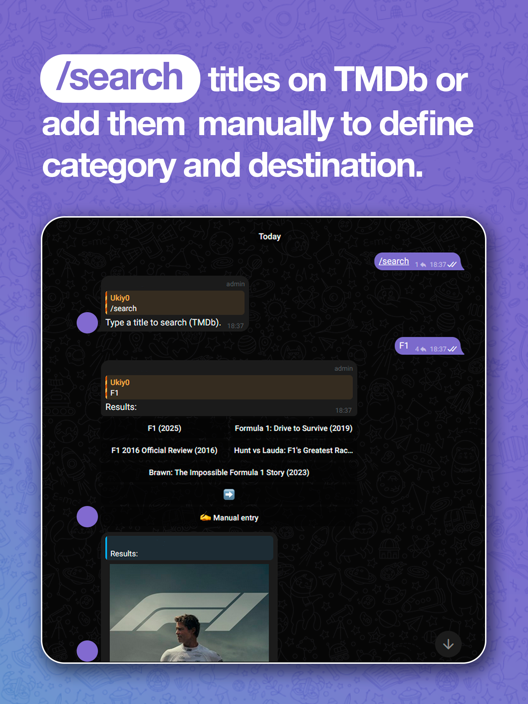
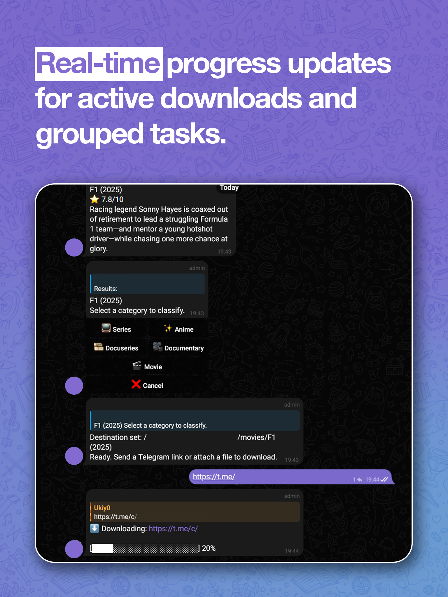
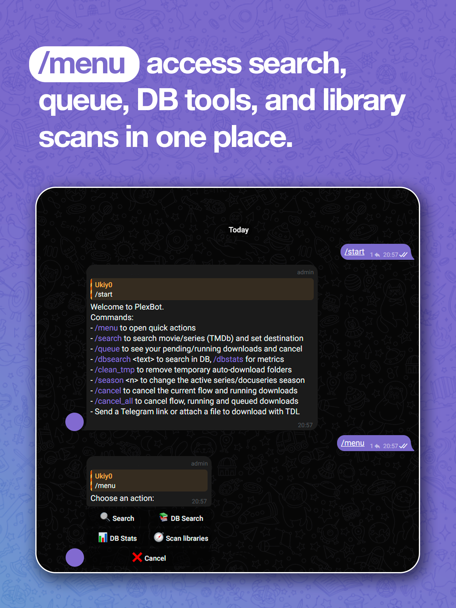

# PlexBot

Telegram bot that pulls media from Telegram messages using [TDL](https://github.com/iyear/tdl-telegram), matches titles with TMDb, and stores everything in a Plex-friendly library layout.

<p align="center">
  <strong>⚠️ Notice — Under development</strong><br>
  <em>This bot is currently under active development. It may contain bugs, unexpected behavior, or breaking changes. Use at your own risk and please report issues in the Issues section.</em>
</p>

<p align="center">
  
  
  
  
</p>


## Features
- Accepts Telegram links or forwarded media (documents/videos/photos/audio).
- TMDb lookup + manual entry to classify Movies/Series/Anime/Docuseries/Documentary.
- Auto-creates destination folders per title/season; Plex-style renaming and permissions.
- Global FIFO queue (single worker) with progress updates; queue view and per-title cancel.
- Post-processing: archive extraction (zip/rar) and file renaming for Plex.
- Library scanner + DB search/stats helpers.
- Auto-creates DB schema and seeds libraries from config if missing.

## Quickstart (local)
1. Install Python deps:
   ```bash
   pip install -r requirements.txt
   ```
2. Install TDL (one of):
   ```bash
   go install github.com/iyear/tdl-telegram/cmd/tdl@latest
   # or download a release tarball and put `tdl` on PATH
   ```
   Log in once (stored in `TDL_HOME`):
   ```bash
   tdl login
   ```
3. Configure libraries: edit `config/libraries.yaml` with your library roots.
4. Set environment (or `.env`):
   - `TELEGRAM_BOT_TOKEN` (required)
   - `TMDB_API_KEY` (required)
   - `PLEX_DB_URL` (optional, default `sqlite:///plexbot.db`)
   - `TDL_HOME` (recommended, persistent path for TDL session)
5. Run the bot:
   ```bash
   python -m app.telegram.main
   ```
   Send `/start` to your bot.

## Configuration
- `config/libraries.yaml`: define libraries and optional download overrides (template/home).
- Environment variables:
  - `TELEGRAM_BOT_TOKEN`: Telegram bot token.
  - `TMDB_API_KEY`: TMDb API key.
  - `PLEX_DB_URL`: DB URL (SQLite by default).
  - `TDL_HOME`: where TDL stores its session (persist this).
- The bot auto-creates tables and seeds libraries from `config/libraries.yaml` if empty.

## Commands
- `/start` — help.
- `/menu` — quick actions (search, DB search/stats, scan).
- `/search` (alias `/buscar`) — TMDb search + destination setup.
- `/season <n>` (alias `/temporada`) — switch active season for a selected series/docuseries.
- `/queue` — show running/pending downloads; cancel by title.
- `/cancel` — cancel current flow + running download for this chat.
- `/cancel_all` — cancel flow + running and queued downloads for this chat.
- `/dbsearch <text>` — search stored shows.
- `/dbstats` — DB metrics.
- `/scan` — rescan libraries and sync DB.
- `/clean_tmp` — remove temp auto-download folders.

## Workflows and behaviors
### Download flow
1) `/search` → pick title (TMDb or manual) → choose category → season (if series).  
2) Destination is set; send a Telegram link or attach a file. The item is queued.  
3) Queue is grouped per title: cancelling one entry in `/queue` cancels that title’s running + queued tasks.

### Direct drop without /search
- If you send a link/file without a destination, the bot prompts TMDb/manual + category selection first.

### Queue semantics
- Single global worker (FIFO).  
- `/queue` groups by content/title; cancel removes all pending tasks for that title (and stops it if running).  
- Progress is rate-limited; grouped downloads use best-effort progress estimation.

### Post-processing
- Archives (zip/rar/volumes) are extracted in place; video files renamed to Plex-friendly names.  
- Ownership/permissions are set to UID 1000 / GID 1000 (tweak in code if needed).

### Library scan and DB
- `/scan` scans configured libraries and ingests Show/Season/Episode records.  
- `/dbsearch` and `/dbstats` query the same DB; useful after `/scan` or downloads.  
- CLI equivalents: `python -m cli.manage scan --all`, `python -m cli.manage stats`, etc.

## Maintenance CLI (optional)
- `python -m cli.manage init-db` — create tables (usually auto-created by the bot).
- `python -m cli.manage seed-libs` — seed libraries from `config/libraries.yaml`.
- `python -m cli.manage libs` — list libraries.
- `python -m cli.manage scan --all` — scan all libraries.
- `python -m cli.manage stats` — DB metrics.

## Groups vs direct messages
- Works in DMs or groups. In groups, commands work the same; downloads/queues are per chat ID.  
- Ensure the bot can read messages/attachments in the group.

## TDL notes
- Requires one-time `tdl login`; session stored in `TDL_HOME` (persist/mount it if containerized).  
- TDL command template is configurable via `config/libraries.yaml` (`download.tdl_template`) and `TDL_HOME`.


