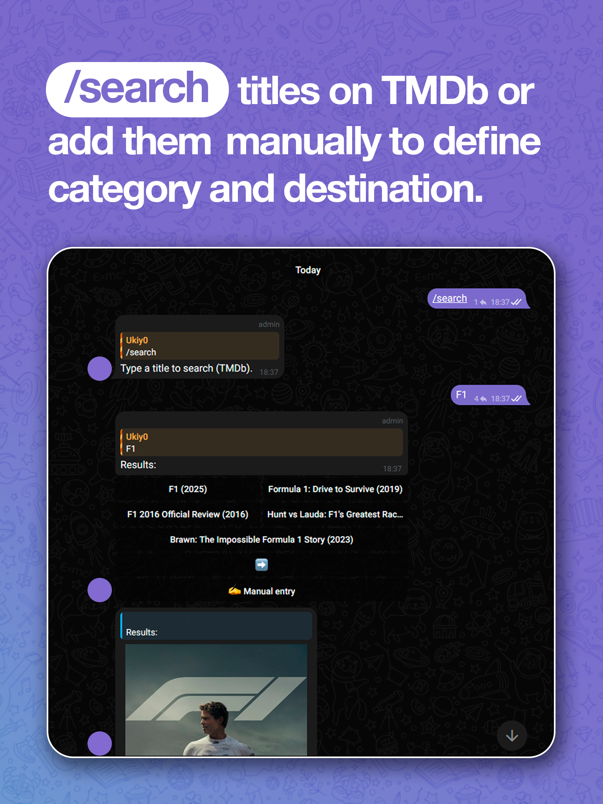
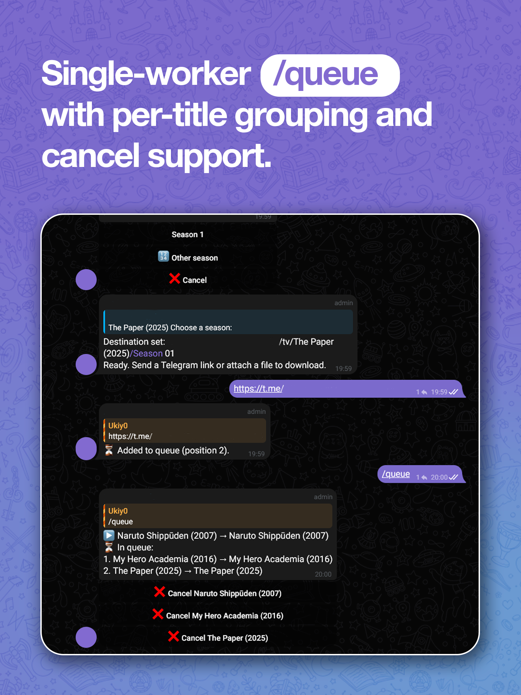
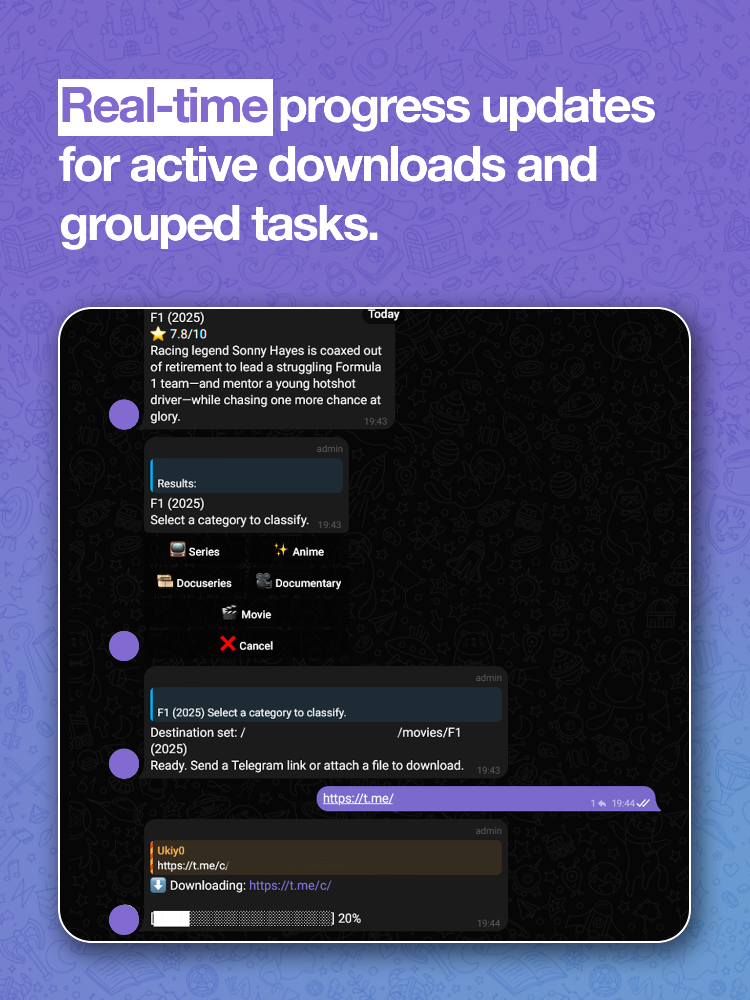
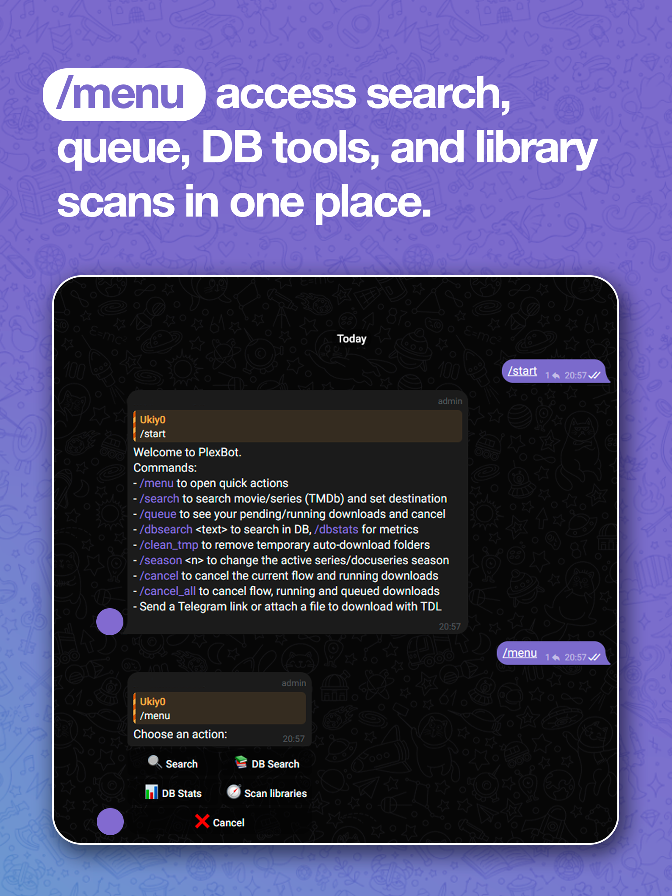

<p align="center">
  <h1 align="center">PlexBot</h1>
  <p align="center">
    <em>Forward a Telegram link → it lands in Plex, renamed and organized.</em>
  </p>
  <p align="center">
    <a href="#quickstart"><strong>Quick Start</strong></a> ·
    <a href="#features">Features</a> ·
    <a href="#configuration">Configuration</a> ·
    <a href="#docker">Docker</a> ·
    <a href="#how-it-works">How It Works</a>
  </p>
</p>

---

<p align="center">
  
  
  
  
</p>

---

**PlexBot** is an async Telegram bot that downloads media from Telegram groups, automatically detects titles and metadata, matches them against TMDb, renames files for Plex compatibility (ASCII-only, SxxExx format), and places them into the correct library folders — all with zero manual renaming.

## Features

- **Smart filename parsing** — extracts title, season, episode, and year from messy scene-release names
- **TMDb auto-detection** — searches TMDb automatically and shows the top results with posters
- **Plex-compatible renaming** — `S01E02 - Title.mkv` for series, `Title (Year).mkv` for movies, ASCII-only
- **Library auto-detection** — if a show already has a folder, skips library selection
- **Batch downloads** — forward multiple files, confirm once, all queue up
- **Recent destinations** — re-download to the same show/season with one tap
- **Archive extraction** — automatic RAR/ZIP/7z extraction after download
- **FIFO download queue** — single-worker with progress bars, per-title cancel
- **Multi-user groups** — state scoped per chat, any group member can send links
- **No database** — in-memory session cache, no SQLite, no ORM

## Quickstart

### 1. Create a Telegram Bot

Message [@BotFather](https://t.me/BotFather) on Telegram → `/newbot` → copy the token.

### 2. Get a TMDb API Key

Register at [https://www.themoviedb.org/settings/api](https://www.themoviedb.org/settings/api) → request an API key (free).

### 3. Install & authenticate `tdl`

```bash
# macOS
brew install iyear/tap/tdl

# Linux
curl -Lo /usr/local/bin/tdl https://github.com/iyear/tdl/releases/latest/download/tdl_Linux_64bit.tar.gz
tar -xzf /usr/local/bin/tdl_Linux_64bit.tar.gz -C /usr/local/bin tdl

# Authenticate (one time — stores session)
tdl login -T phone
```

> **Important:** `tdl` requires a one-time login with your Telegram phone number. The session is stored in `TDL_HOME` (default `~/.tdl`). In Docker, mount this as a volume so it persists.

### 4. Configure libraries

Edit `config/libraries.yaml`:

```yaml
libraries:
  - name: "TV Shows"
    type: series
    root: /media/tv

  - name: "Movies"
    type: movie
    root: /media/movies

  - name: "Anime"
    type: series
    root: /media/anime
```

- `type: series` → episodic, SxxExx naming, asks for season number
- `type: movie` → standalone, `Title (Year).ext` naming

### 5. Set environment variables

Create `config/.env`:

```bash
TELEGRAM_BOT_TOKEN=123456:ABC-DEF
TMDB_API_KEY=your_tmdb_bearer_token
ADMIN_CHAT_ID=123456789          # optional — restricts admin commands
TDL_HOME=/data/tdl              # optional — tdl session path
```

### 6. Run

```bash
pip install -r requirements.txt
python -m app.bot
```

Or use Docker (see [Docker](#docker) section).

## Docker

```yaml
# docker-compose.yml
services:
  plexbot:
    build: .
    env_file: config/.env
    environment:
      - TZ=${TZ:-UTC}
    volumes:
      - ./config:/app/config:ro
      - ./data:/data
      - /your/media/tv:/media/tv
      - /your/media/movies:/media/movies
      - /your/media/anime:/media/anime
    restart: unless-stopped
```

**tdl must be available inside the container.** Either:

```dockerfile
# Option A: Download tdl during build (add to Dockerfile)
RUN curl -Lo /usr/local/bin/tdl https://github.com/iyear/tdl/releases/latest/download/tdl_Linux_64bit.tar.gz \
    && tar -xzf /usr/local/bin/tdl_Linux_64bit.tar.gz -C /usr/local/bin tdl \
    && rm /usr/local/bin/tdl_Linux_64bit.tar.gz
```

```bash
# Option B: Bind-mount the host binary
# Add to docker-compose.yml volumes:
#   - /usr/local/bin/tdl:/usr/local/bin/tdl:ro
```

**Authenticate tdl inside the container once:**

```bash
docker compose run --rm plexbot tdl login -T phone
# Session persists in ./data/tdl
```

Then:

```bash
docker compose up -d
```

## Configuration

### Environment Variables

| Variable | Required | Description |
|---|---|---|
| `TELEGRAM_BOT_TOKEN` | Yes | Telegram bot token from @BotFather |
| `TMDB_API_KEY` | Yes | TMDb API v3 Bearer token |
| `ADMIN_CHAT_ID` | No | Your Telegram user ID — restricts admin commands |
| `TDL_HOME` | No | Path to tdl session directory (default: `~/.tdl`) |

### Library Types

| Type | Behavior | Naming | Folder Structure |
|---|---|---|---|
| `series` | Asks for season number | `S01E02 - Title.mkv` | `Show (Year)/Season 01/` |
| `movie` | Auto-queues immediately | `Title (Year).mkv` | `Title (Year)/` |

### Download Settings

In `config/libraries.yaml`:

```yaml
download:
  tdl_template: 'tdl dl -u {url} -d "{dir}" -t 16 -l 9 --reconnect-timeout 0 --template "{{ .FileName }}"'
  # tdl_home: /data/tdl  # optional: separate session directory
```

- `{url}` and `{dir}` are replaced at runtime
- `--template "{{ .FileName }}"` preserves original filenames (avoids Go template conflicts)
- `-t 16` = 16 threads, `-l 9` = log level 9 (progress)

## How It Works

```
┌─────────────────────────────────────────────────────────┐
│                    User sends link/file                  │
└────────────────────────┬────────────────────────────────┘
                         │
                         ▼
              ┌─────────────────────┐
              │  Filename parsing    │
              │  "Show.S01E02.      │
              │   1080p.WEB-DL.mkv" │
              │       ↓             │
              │  Title: "Show"      │
              │  Season: 1          │
              │  Episode: 2         │
              └──────────┬──────────┘
                         │
                         ▼
              ┌─────────────────────┐
              │  TMDb auto-search   │
              │  → Top 3 results    │
              │  → Poster images    │
              └──────────┬──────────┘
                         │
              ┌──────────┴──────────┐
              │                     │
              ▼                     ▼
         ┌─────────┐         ┌──────────┐
         │  Series  │         │  Movie   │
         │          │         │          │
         │ Pick     │         │ Auto-    │
         │ season   │         │ queue    │
         └────┬─────┘         └────┬─────┘
              │                    │
              ▼                    ▼
         ┌──────────────────────────────┐
         │      Download via tdl        │
         │  (FIFO queue, progress bar)  │
         └──────────────┬───────────────┘
                        │
                        ▼
         ┌──────────────────────────────┐
         │      Post-processing          │
         │  1. Extract archives (RAR/ZIP)│
         │  2. Rename for Plex            │
         │  3. Set permissions (1000:1000)│
         └──────────────────────────────┘
```

### Filename Parsing

PlexBot detects metadata from messy filenames:

| Input | Title | Season | Year |
|---|---|---|---|
| `Breaking.Bad.S01E02.1080p.WEB-DL.x264.mkv` | Breaking Bad | 1 | — |
| `Euphoria.(2019).S03E05.1080p.WEB-DL.mkv` | Euphoria | 3 | 2019 |
| `Oppenheimer.(2023).1080p.WEB-DL.mkv` | Oppenheimer | — | 2023 |
| `Te van a matar (2026) by kowalski&xusman` | Te van a matar | — | 2026 |
| `Greenland 2 (2026) UHD BluRay REMUX 2160p` | Greenland 2 | — | 2026 |

Extracted season is pre-filled in the season picker. Year is used in folder names. All SxxExx patterns, resolution tags, codec names, language codes, and release group suffixes are stripped before TMDb search.

## Commands

| Command | Description |
|---|---|
| `/start` | Show main menu |
| `/menu` | Return to dashboard |
| `/search` | Manual TMDb search |
| `/queue` | View running/pending downloads |
| `/cancel` | Cancel current flow + running download |
| `/cancel_all` | Cancel everything for this chat |
| `/clean_tmp` | Remove temp download folders (admin only) |

## Bot Commands

## Groups vs DMs

- Works in **both** DMs and groups
- In groups, any member can send links — state is scoped per chat
- Groups must be **public** (or have a public invite link) for `tdl` to resolve forwarded message download links

## Project Structure

```
app/
├── bot.py               # Entry point — handler registration
├── config.py            # Libraries YAML + .env loader
├── state.py             # Conversation state constants + reset
├── handlers/
│   ├── ingest.py         # Link/file intake — auto metadata, batch handling
│   ├── search.py         # TMDb search, season/library selection
│   ├── menu.py           # /start, /menu, dashboard, queue view
│   └── download.py       # Download queue, tdl subprocess, post-process
└── services/
    ├── tmdb.py           # TMDb API client
    ├── downloader.py     # tdl subprocess wrapper — progress, retries
    ├── extractor.py      # RAR/ZIP/7z detection and extraction
    └── namer.py          # Plex-safe naming — ASCII, SxxExx, collision handling

config/
└── libraries.yaml        # Library definitions (user-editable)
```

## Limitations

- **No persistence** — in-memory state resets on restart (download queue, recent destinations, conversation state)
- **Single download worker** — downloads are sequential (one `tdl` at a time to avoid TDLib session conflicts)
- **UID/GID hardcoded** — files are created with `1000:1000` ownership; make configurable in `config/libraries.yaml` if needed
- **Public groups only** — `tdl` cannot resolve download links from private Telegram groups
- **tdl required** — must be installed and authenticated separately

## License

MIT